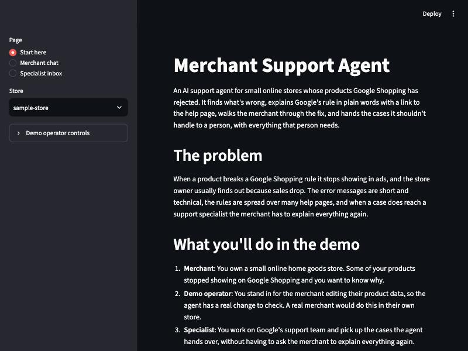
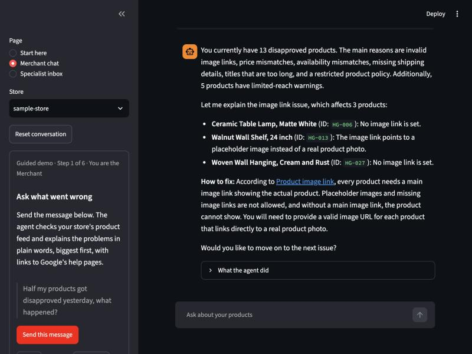
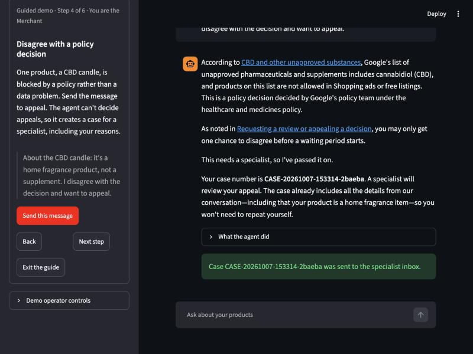
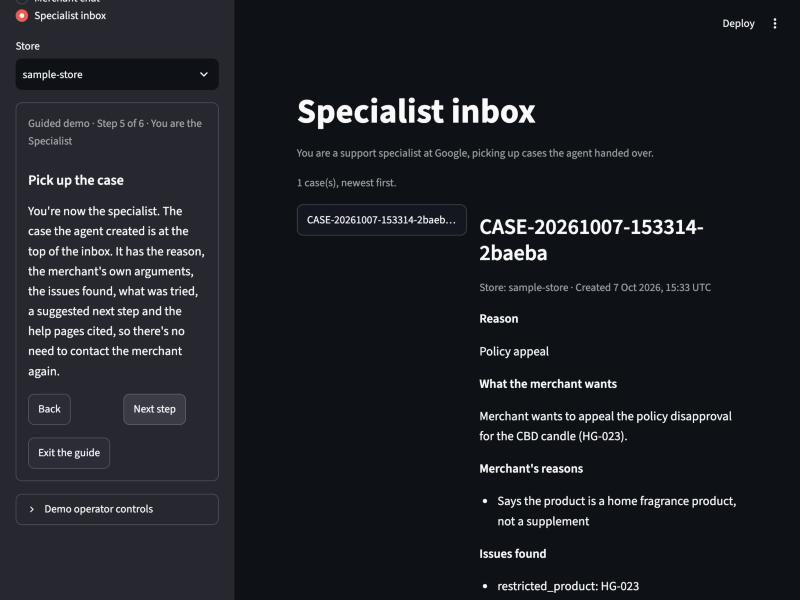
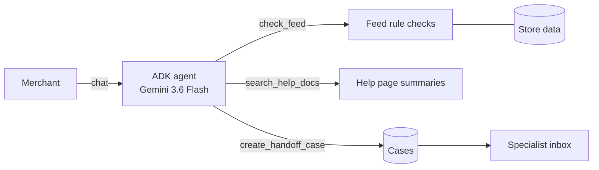

# Merchant Support Agent

An AI support agent for small online stores whose products Google Shopping has rejected. It finds what's wrong in the merchant's product data, explains Google's rule in plain words with a link to the help page, walks the merchant through the fix, and checks again when they say it's done. When a case needs a person (an account suspension, a policy appeal, a frustrated merchant), it hands it to a specialist with a complete case, so nobody has to explain things twice.

Built as a product-management portfolio project: PRD, spec, plan, evals and business case included.

| Start here | Guided chat | Handoff | Specialist inbox |
|---|---|---|---|
|  |  |  |  |

## Results

Measured on 47 scripted conversations (40 main, 7 held out), each run twice against the live model. Full detail is in [docs/v1-results.md](docs/v1-results.md).

| PRD metric | Target | v1 result |
|---|---|---|
| Resolution rate (plain data fixes resolved without a handoff) | 80% or higher | **100%** |
| Wrong advice rate (claims no help page supports, AI graded) | under 5% | **0 to 3%** |
| Handoff precision (handoffs that were needed) | 90% or higher | **100%** |
| Handoff recall (needed handoffs that happened) | 95% or higher | **100%** |
| Case completeness (specialist needs nothing more, AI graded) | 90% or higher | **100%** |
| Cost per conversation | tracked | **about $0.02** |

At Gartner's average of $8.01 per live support contact, the agent pays for its model cost if it resolves about 1 contact in 400. The [business case](docs/business-case.md) models savings of 30 to 70% of support cost, depending on how many real contacts it contains, and recommends a shadow pilot to measure that.

These are strong numbers on small, simulated samples written by the same person who built the agent. [How to read them](docs/v1-results.md#read-these-numbers-with-care).

## The problem

When a product breaks a Google Shopping rule it's disapproved and stops showing in ads, and the store owner usually finds out because sales drop. The error messages are terse ("Missing value [gtin]"), the rules are spread across many help pages, and one feed often has several problems at once. Some problems need a person at Google, and when the merchant reaches one, they start from scratch.

For Google, every contact a person handles costs money, and every hour a product stays disapproved is lost ad revenue. The full problem statement is in the [PRD](docs/PRD.md).

## What it does

1. **Diagnoses.** It runs rule checks over the merchant's feed: GTIN, price and availability against the landing page, image links, title length, shipping, restricted products. It summarizes the problems, disapprovals first, with warnings kept separate.
2. **Explains with sources.** It searches a set of paraphrased Merchant Center help pages and only states rules those pages support, with a link to each one.
3. **Walks through the fix.** It goes one issue at a time, names every affected product, and re-checks the feed when the merchant says it's fixed.
4. **Hands off when it should.** It hands off for a suspension, an appeal, a request for a person, repeated failure, or a question no help page answers. It never hands off a plain data fix.
5. **Writes a complete case.** The case includes the reason, the issues, the merchant's own arguments, what was tried, the cited policy and a suggested next step. Specialists see it in an inbox.

## How it works



- **Google Agent Development Kit (ADK) with `gemini-3.6-flash`.** The agent has three tools, all plain, tested Python functions. The model only decides which tool to call.
- **The store comes from the session, never from the model.** A merchant can't ask the agent to read another store's data.
- **A web app** (FastAPI with a Material Web front end): a Needs attention page with an assistant side panel, and a separate specialist page. Every piece of logic lives in `src/` and is tested, including the API (v2, in progress).
- **An eval harness** (`evals/`). It runs scripted conversations on throwaway copies of the data, scores them with rules plus an AI grader, and saves every run. It can resume interrupted runs and compare two runs.

## How it's measured

- **Rule checks:** did it hand off, and why? Did it re-check after a fix, and is the issue gone? Did it say what it must, avoid what it mustn't, and cite the right pages?
- **AI grader:** a second model call grades two things against fixed rubrics: advice no retrieved help page supports, and whether a specialist could act on the case without re-asking. Vikrant hand-checked 10 graded items and agreed with all 10.
- **Held-out set:** 7 cases written and committed before the final prompt changes, then never edited, to check that the fixes generalize. A test also fails if the agent's instructions ever quote an eval case.
- **Repetition:** every result is from two runs, because the same agent varies between runs.

## What went wrong, and how it was fixed

The evals earned their keep. The most useful findings, in order:

1. **The first full runs missed two targets** (wrong advice 7%, case completeness 87%). The root cause was the agent's own instructions: they stated our handoff process as Google policy ("only a human can decide an appeal"), and appeal cases dropped the merchant's argument. Removing those lines and adding a field for the merchant's reasons fixed both ([Checkpoint D](docs/checkpoint-d.md), [Task 11](docs/task11-before-after.md)).
2. **That fix caused a new failure.** The agent began opening an appeal when a merchant only asked how to get a product approved. The evals caught it, and one clarifying rule fixed it.
3. **I leaked test wording into the prompt.** The example merchant reasons in the new instructions echoed two eval cases, one of them held-out. I caught it in review, replaced the examples, re-ran the affected cases, and added a test that blocks it from happening again.
4. **Some eval checks were wrong, not the agent.** Five text patterns failed correct replies (for example, "No, *not* all of your products are approved" matched the "claims approval" pattern). Each was fixed with a regression test using the real reply, and each is disclosed.
5. **The grader was too lenient at first.** It rated an incomplete appeal case as complete, so the rubric got a worked example before any scored run.
6. **Operational issues.** A run hung for 20 minutes when the laptop went to sleep, so requests now time out and runs can resume. The grader also crashed on an empty model reply, so it now retries and records the failure.

## Product decisions

- **A missing GTIN is a warning, not a disapproval,** because Google's own help page says it "may" limit visibility ([decision 0002](docs/decisions/0002-issue-severity.md)).
- **Handoff recall has the strictest target (95%),** because missing a suspension or an appeal is worse than one extra handoff.
- **Answers must be grounded or handed off.** "I couldn't find official guidance" plus a handoff beats a confident answer from memory.
- **Responsible AI:** grounding, human decisions, privacy and the limits of the measurement are covered in [docs/responsible-ai.md](docs/responsible-ai.md).

## Run it

```bash
uv sync                      # install dependencies
cp .env.example .env         # then add a Gemini API key from Google AI Studio
uv run pytest                # unit tests (no model calls)
ACCESS_CODE=pick-one uv run uvicorn merchant_agent.web.api:app --port 8765
```

Open http://localhost:8765. The page shows the demo store's **Needs attention** issues. **Help me fix this** on a row opens the assistant already knowing that issue, and **Help** opens it without one. Live chat needs the access code you set; replay mode needs none. **Edit** changes a product, then the assistant can check again. The specialist page is linked from the left nav; its demo code is shown on the page. Each browser session works on its own copy of the demo store, so the original `data/` is never changed.

Other entry points:

```bash
uv run python -m merchant_agent.cli --store sample-store   # chat in the terminal
uv run python -m evals.run                                  # main eval set (about $1 per run)
uv run python -m evals.run --set heldout                    # held-out set
uv run python -m evals.compare RUN1.json RUN2.json          # compare two runs
```

## Project layout

```
docs/                PRD, decisions, checkpoint reports, results, business case, responsible AI
data/stores/         simulated stores: account status and a product feed with planted problems
data/help_docs/      paraphrased Merchant Center help pages, each with its source link
src/merchant_agent/  models, Merchant API shapes and mock data tools, help search, handoff, agent, chat, demo
src/merchant_agent/web/  FastAPI app and the static front end (Material Web)
evals/               case files (main and held-out), eval-only stores, runner, scorers, grader, rubrics, results
tests/               unit tests, including API tests with a fake agent
scripts/             scripted end-to-end runs used at Checkpoint B
```

## How this was built

Spec first: a [PRD](docs/PRD.md), a technical [spec](SPEC.md) and a task [plan](tasks/plan.md), built in 12 tasks with four checkpoints. The coding was done with an AI coding agent (Claude Code), working test-first in small commits, and was audited against a set of engineering skills partway through ([skills audit](docs/skills-audit.md)). The commit history shows the whole process, including the mistakes above.

## Limitations

- **Simulated stores.** The stores and landing-page data are simulated, and the help pages are paraphrased summaries. Real traffic would have a different mix of problems.
- **Basic search.** Help search is keyword-based over 11 pages.
- **Narrow scope.** It's English only and uses one model, with no live monitoring.
- **Small samples.** The eval samples are small. Read the results as evidence, not proof ([details](docs/v1-results.md#read-these-numbers-with-care)).
