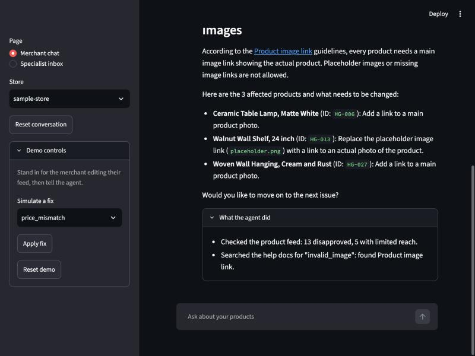

# Merchant Support Agent

An AI agent that helps online store owners fix rejected Google Shopping products. It diagnoses the product feed, explains the rule from real help docs, walks the merchant through the fix, and hands the case to a human specialist with a clean summary when it can't solve it.

> Status: the agent, merchant chat and specialist inbox work end to end on simulated stores. Evals are next. See `docs/PRD.md` for what we're building and `docs/decisions/` for why.

## Project layout

```
merchant-support-agent/
  docs/             PRD, decision records, eval reports (the "PM" side)
  data/
    stores/         simulated stores: account status + product feed with planted problems
    help_docs/      saved policy and help pages the agent can search
  src/merchant_agent/
    models.py       shared data shapes (Product, Issue, Case)
    config.py       settings loaded from .env
    tools/          the actions the agent can take, one file per tool
    agent.py        wires the model and tools together
    chat.py         runs conversation turns (shared by the app and the terminal chat)
    demo.py         resettable demo copy of the data, and simulated merchant fixes
  app/              Streamlit app: merchant chat and specialist inbox
  scripts/          scripted end to end runs against Gemini
  evals/
    cases/          test conversations with expected outcomes
    results/        scored runs, one file per run
  tests/            unit tests for the tools (no model calls)
```

## Getting started

```bash
uv sync                      # install dependencies
cp .env.example .env         # then add your Gemini API key
uv run pytest                # run unit tests
uv run streamlit run app/streamlit_app.py
```

## Run the demo

```bash
uv run streamlit run app/streamlit_app.py
```

1. On **Merchant chat**, pick `sample-store` and ask "Half my products got disapproved yesterday, what happened?". Open **What the agent did** under a reply to see which tools it called.
2. In **Demo controls**, choose `missing_shipping` and click **Apply fix** to play the merchant fixing their feed, then tell the agent "I added the shipping info. Can you check again?". It re-checks the feed.
3. Ask to appeal the CBD candle. The agent hands off and the case appears on **Specialist inbox**.
4. Pick `suspended-store` to see an account suspension handed off straight away.

The app works on a copy of `data/` in `runtime/demo-data`. **Reset demo** restores the original store data and clears all cases, so the demo can be run again from the start.

You can also chat in the terminal with `uv run python -m merchant_agent.cli --store sample-store`.

| Merchant chat | Handoff | Specialist inbox |
|---|---|---|
|  |  |  |

See `CONVENTIONS.md` for how code in this repo is written.
