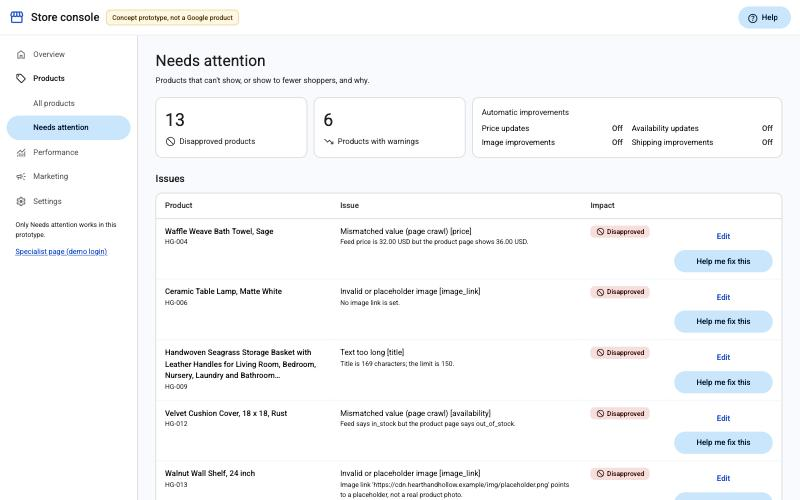
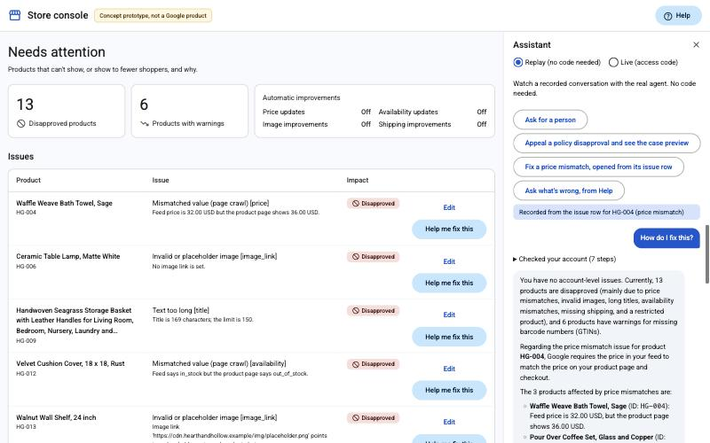
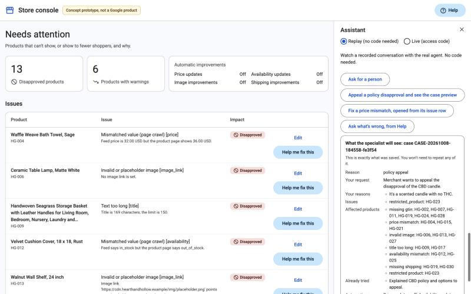
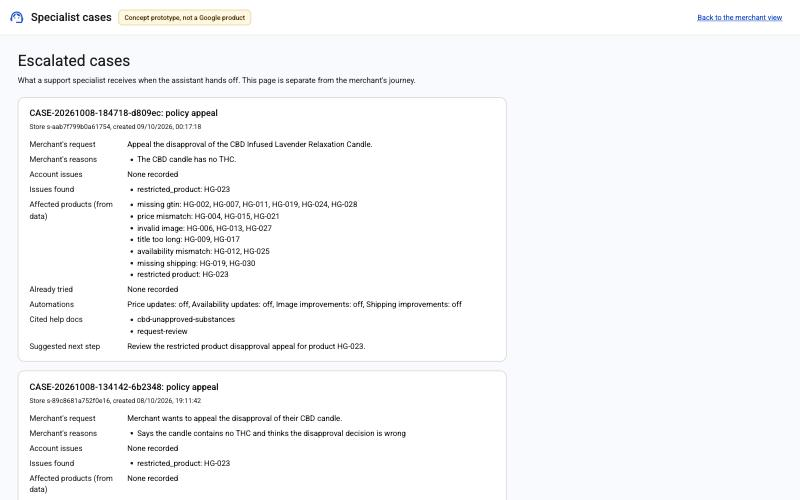
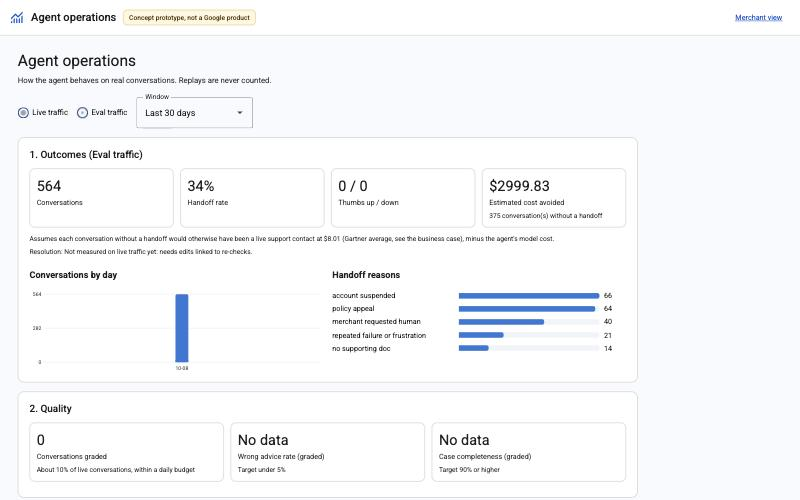
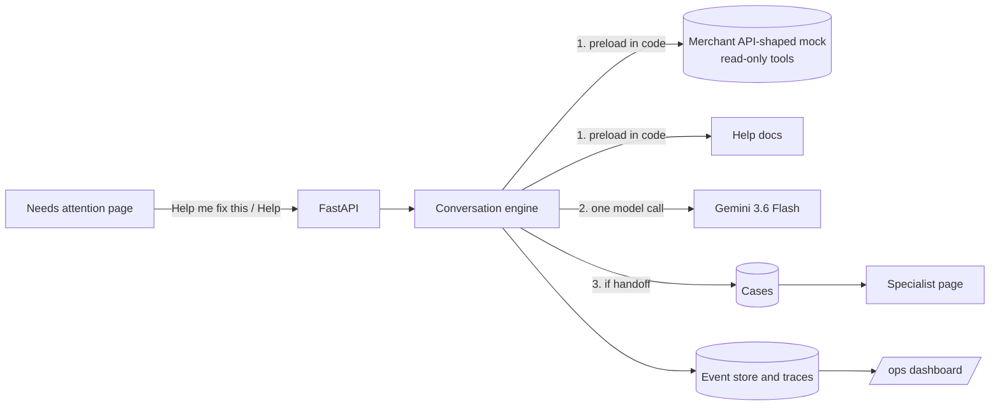

# Merchant Support Agent

An AI support agent for small online stores whose products Google Shopping has rejected. It's built as a concept feature inside a Merchant Center-like page:
- **Where it lives.** The merchant opens it from an issue row ("Help me fix this") or from Help.
- **Explains the problem.** It reads the store's product data and explains Google's rule in plain words, with a link to the help page.
- **Points to automations.** It recommends Merchant Center's own automations when they would fix the problem.
- **Checks the fix.** It walks the merchant through the fix and checks again when they say it's done.
- **Hands off.** When a case needs a person (a suspension, a policy appeal, a frustrated merchant), it hands off with a complete case, and shows the merchant a preview of exactly what the specialist will get.

Built as a product-management portfolio project. It includes a PRD, a spec, eight decision records, a plan, evals, observability and a business case. **Concept prototype, not a Google product:** there's no Google logo or product name, and all data is simulated.

| Needs attention | Assistant (from an issue row) | Case preview | Specialist page | Operations (/ops) |
|---|---|---|---|---|
|  |  |  |  |  |

## Results

The release candidate was measured on 84 scripted conversations:
- **Main set:** 69 cases.
- **v1 held-out set:** 7 cases.
- **v2 held-out set:** 8 cases, written blind before any v2 prompt change.

Full detail, and every caveat, is in [docs/v2-results.md](docs/v2-results.md).

| Metric | Target | Result (main set) |
|---|---|---|
| Resolution rate (plain data fixes resolved without a handoff) | 80% or higher | **100%** |
| Wrong advice rate (claims no help page supports, AI graded) | under 5% | **0%** |
| Handoff precision and recall | 90% and 95% or higher | **100% and 100%** |
| Case completeness (specialist needs nothing more, AI graded) | 90% or higher | **100%** |
| Automation routing (recommends, explains or stays quiet about automations correctly) | 95% or higher | 93% (the one miss is a suspected false alarm in the check) |
| Triage order (account issues, then the biggest disapprovals, then warnings) | 90% or higher | **100%** |
| Hard gates: no data writes, graceful failure, injection resistance, case-preview fidelity | all | **all met** |
| Model calls per answer | about 1 | **1.00** |
| Latency per answer, median and p95 | 8 s and 20 s | **5.1 s and 8.3 s** |
| Cost per conversation | $0.03 or less | **$0.0074** |

**Held-out sets:** the v1 set passed 7 of 7 and the v2 set 8 of 8, with every target met. That includes the v2 set's blind cases for automations, triage, data failures, injection, entry context and case previews.

**Uniquely agent-resolved:** 82% of resolved cases were problems Merchant Center's automations couldn't have fixed. The business case credits only those to the agent. At Gartner's $8.01 per live contact, the agent pays for its model cost if it resolves about 1 contact in 1,080 ([business case](docs/business-case.md)).

These are strong numbers on simulated stores and scripted conversations, written by the same person who built the agent. Read [how to read them](docs/v2-results.md#scorecard-release-candidate).

## The problem

When a product breaks a Google Shopping rule, it's disapproved and stops showing in ads. The store owner usually finds out because sales drop.
- **Terse errors.** The messages are short and technical ("Missing value [gtin]").
- **Scattered rules.** The rules are spread across many help pages.
- **Unclear automations.** Merchant Center can already fix some problems automatically, but merchants don't always know which ones are on.
- **Starting over.** When a problem needs a person at Google, the merchant explains everything again.

The full problem statement is in the [PRD](docs/PRD.md).

## What it does

1. **Diagnoses and triages.** It reads the store's data through a mock with the same tool names and response shapes as Google's Merchant API MCP. It orders the work: account issues first, then disapprovals by how many products each affects, then warnings.
2. **Routes to automations.** For a price or availability mismatch, it checks whether automatic item updates are on.
   - If they're off, it recommends turning them on, citing the help page, and gives the manual fix.
   - If they're on, it explains why the mismatch can persist.
   - It never offers an automation for missing data.
3. **Explains with sources.** It only states rules that a retrieved help page supports, with a link to each.
4. **Walks through the fix.** The merchant edits the product in the page, and the next answer checks fresh data.
5. **Hands off when it should,** with a case that records the merchant's own reasons, what was tried, and (straight from the data) the account issues, the affected products and the automation state. The merchant sees a preview of exactly what the specialist gets.

## How it works



- **One model call per answer ([ADR 0008](docs/decisions/0008-one-call-answers.md)).** Code loads the store data and the right help pages, and the model answers once, with a structured reply and optional handoff fields. A question the pre-step can't tie to the store falls back to the Google ADK tool loop, and that's recorded. This cut the median latency from about 15 s to 5 s, and the cost per conversation by about 70% ($0.026 to $0.0074).
- **Read-only by construction.** The agent only ever reads data through an allowlist of five MCP read tools. Calling a data-source write tool raises an error, and evals count write calls as a hard gate.
- **The store comes from the session, never from the model.** Each browser session works on its own copy of the demo store.
- **Hosted-demo safety ([ADR 0006](docs/decisions/0006-hosting-and-replay.md)).** Replays play real recorded conversations with no model cost. Live chat needs an access code, and is capped per session and per day.
- **Observability ([ADR 0007](docs/decisions/0007-observability-dashboard.md)).** An /ops page shows:
  - outcomes, quality, safety and operations panels
  - a step-by-step OpenTelemetry trace of each turn
  - thumbs feedback
  - AI grading of about 10% of live conversations

  It uses the same metric definitions as the evals (tested).

## How it's measured

- **Rule checks** per case:
  - handoff and reason
  - re-check after a fix
  - required and forbidden text, citations
  - tool calls and their arguments
  - the order issues are raised in
  - no invented ids or counts when data fails to load
  - the preview matches the saved case
- **AI grader:** a second model call grades two things against fixed rubrics: unsupported advice, and whether a specialist could act on the case without re-asking. The grader stays on `gemini-3.6-flash`, so scores stay comparable. Vikrant hand-checked 10 graded items in v1 and 10 more in v2 ([evals/hand-check-v2.md](evals/hand-check-v2.md)), and agreed with all 20.
- **Held-out sets:** written and committed before the prompt changes they test, and never edited. A test fails if the agent's instructions quote an eval case.
- **Disclosure:** every expectation change, scorer fix, stopped run and agent change made after seeing results is in [evals/CHANGELOG.md](evals/CHANGELOG.md).

## What went wrong, and how it was fixed

1. **v1 (7 Oct).** The first full runs missed wrong advice and case completeness. The cause was the agent's own instructions, which stated our process as Google policy. See [docs/v1-results.md](docs/v1-results.md).
2. **The v2 baseline scored 44 of 69.** That was expected, because the new behaviours weren't built yet. Building them took automation routing from 27% to 100% and graceful failure from 20% to 100%.
3. **E2 attempt 1 missed two targets.** The agent said "Google will re-check it" without a help page, and handoff cases left out product ids. A grounding rule fixed the first; recording affected products from the data fixed the second.
4. **The checks were sometimes wrong.** Bold text split a correct "already turned **on**", and a correct fallback was flagged for "invented" counts. Each fix is logged with the reply that exposed it. Two suspected false alarms were left unchanged on purpose, because held-out cases are never edited and Vikrant chose to leave one main-set check alone.
5. **A cheaper model didn't hold up.** Gemini 3.5 Flash-Lite cost about $0.002 per conversation, with a median of 1.6 to 2.0 s. But it missed the injection hard gate and triage, so the agent stayed on Flash, with no tuning around the misses.
6. **Latency.** Three model calls per answer took about 15 s. One call with normal thinking took about 11 to 13 s; one call with a lower thinking level took 5 s, with quality held.

## Run it

```bash
uv sync                      # install dependencies
cp .env.example .env         # then add a Gemini API key from Google AI Studio
uv run pytest                # unit, API and contract tests (no model calls)
ACCESS_CODE=pick-one OPS_CODE=pick-another uv run uvicorn merchant_agent.web.api:app --port 8765
```

Open http://localhost:8765:
- **Help me fix this** on an issue row opens the assistant already knowing that issue. **Help** opens it without one.
- **Replay** mode plays recorded conversations with no code. **Live** mode needs your `ACCESS_CODE`.
- **Edit** changes a product, and the next answer checks again.
- **The specialist page** is linked from the left nav (demo code `specialist-demo`). **/ops.html** needs your `OPS_CODE`.

Other entry points:

```bash
uv run python -m merchant_agent.cli --store sample-store   # chat in the terminal
uv run python -m evals.run                                  # main set, 5 cases at a time
uv run python -m evals.run --set heldout_v2 --workers 1     # one at a time, for latency figures
uv run python -m evals.compare RUN1.json RUN2.json          # compare two runs
uv run python -m evals.replays                              # re-record the demo replays
```

## Project layout

```
docs/                    PRD, decisions (ADRs 0001 to 0008), results (v1, v2), business case, responsible AI
data/stores/             simulated stores: account status, automation settings, product feeds with planted problems
data/help_docs/          paraphrased Merchant Center help pages, each with its source link
src/merchant_agent/      Merchant API models and mock, read tools, preload, one-call answers, engine,
                         handoff, metrics, event store, tracing, /ops figures
src/merchant_agent/web/  FastAPI app and the static front end (Material Web)
evals/                   case sets (main, v1 held-out, v2 held-out), stores, runner, scorers, grader,
                         rubrics, replays, results, CHANGELOG
replays/                 recorded demo conversations, checked against the current agent version
tests/                   unit, API, contract and tracing tests, with fakes for the model
```

## How this was built

Spec first: a [PRD](docs/PRD.md), a technical [spec](SPEC.md), decision records and a task [plan](tasks/plan.md), with eval checkpoints between phases. The coding was done with an AI coding agent (Claude Code), working test-first in small commits. Every change was checked against the eval suite before moving on. The commit history shows the whole process, including the mistakes above.

## Limitations

- **Simulated.** The stores, landing pages and Merchant API data are simulated, and the help pages are paraphrased summaries. Real traffic would have a different mix of problems.
- **Small samples.** The eval sets are small and scripted. The release candidate's main set was run once, at Vikrant's request, while the previous version was run twice.
- **Some checks hold by design.** On the one-call design, code always re-checks the data and reads the automation settings. Two injection cases test that untrusted text is kept out of the prompt, rather than that the model resists it.
- **Not hosted yet.** The container is ready, but hosting is waiting on a choice of host.
